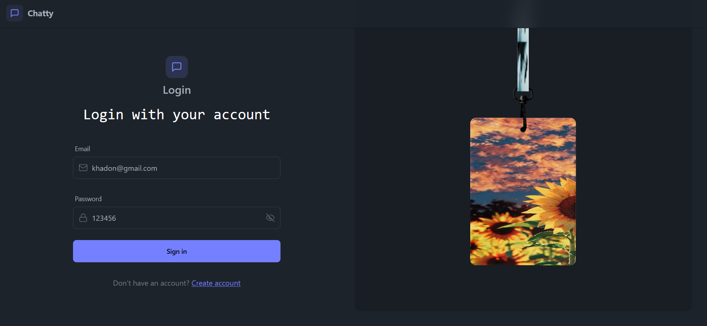
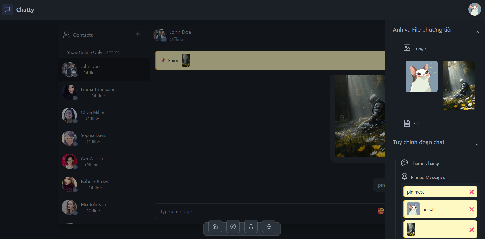
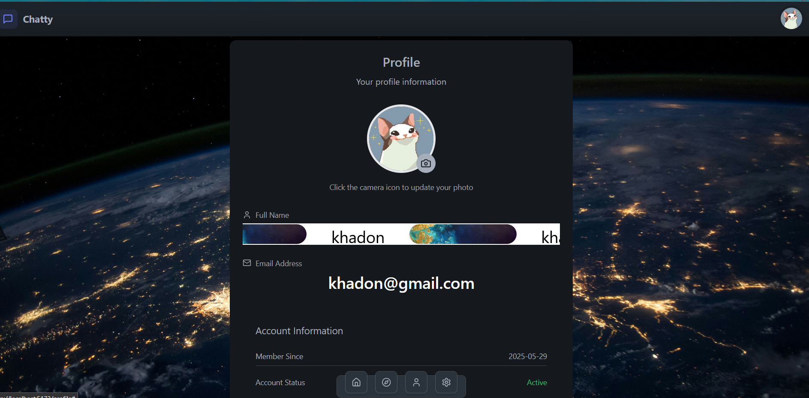
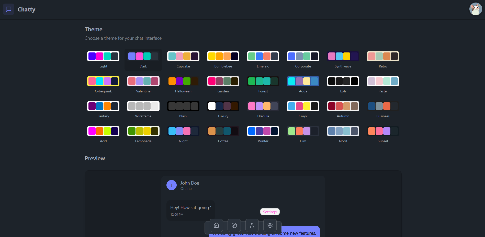
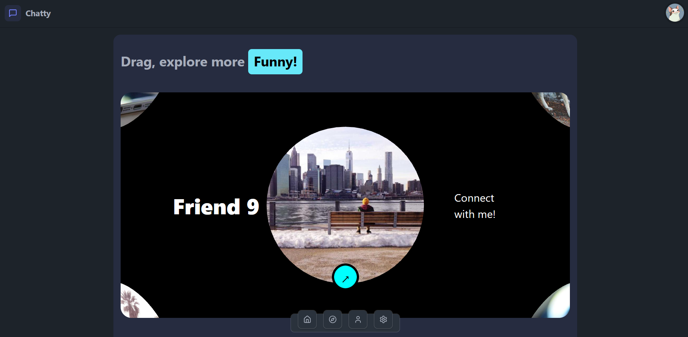

## 🔥 Realtime Chat App 🔥

## Highlights:

-   🌟 Tech stack: MERN + Socket.io + TailwindCSS + Daisy UI
-   🤩 Pages: Login && Register + Home + Setting + Profile + Discover
-   😎 Authentication && Authorization with JWT
-   🚀 Real-time messaging with socket.io
-   🌍 Global state management with Zustand
-   🎨 Theme selection
-   📌 Pin messages list

## Review Pages:

🤗 Login && Register: 
🥳 Home page: 
😠Profile page: 
🨠Setting page: 
💕 Discover page: 
